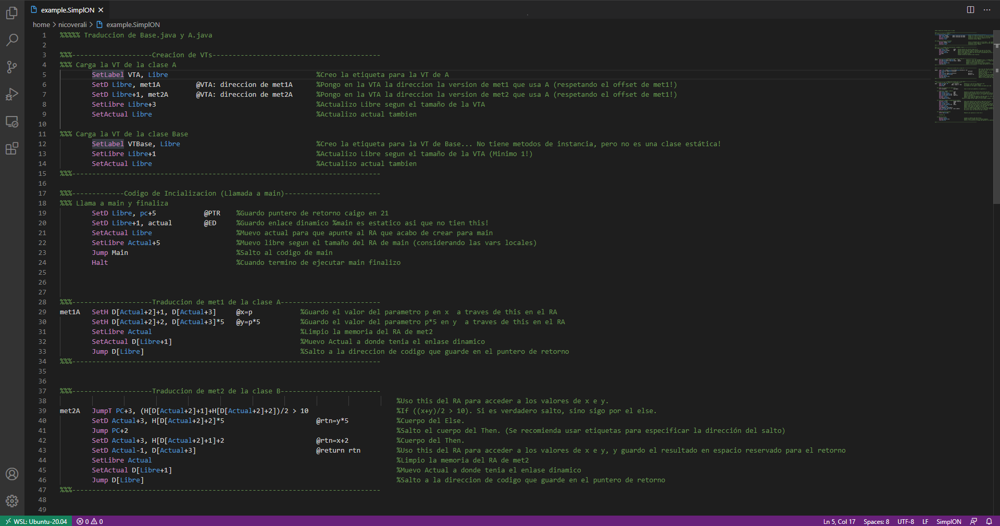

# SimplON - Basic support 

Extensión de VSCode que brinda un soporte básico a la implementación SimplON, del procesador abstracto SimpleSem.

## Caracteristicas

- **Resaltado** para la sintaxis del lenguaje

- **Comentarios** habilitados. Ver en configuración de VSCode como añadir un comentario de linea, por defecto es **Ctrl+/**

- **Snippets** basicos para las instrucciones del lenguaje

### Bugs y recomendaciones

En caso de encontrar un error o tener alguna recomendación por favor comunicarse a __nicolasalevera98@gmail.com__

**Enjoy!**
